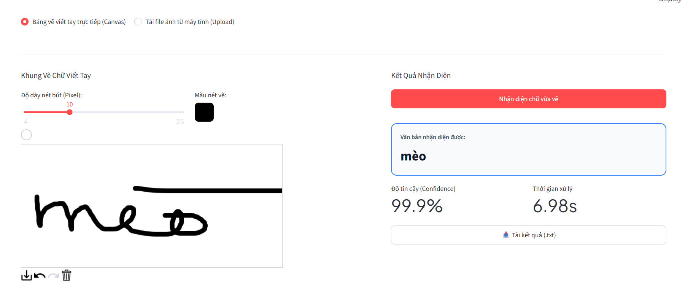

# Vietnamese Handwriting OCR with PaddleOCR

An end-to-end Optical Character Recognition (OCR) system designed specifically for recognizing handwritten Vietnamese text using a fine-tuned PaddleOCR model and an interactive web interface.

---

## Demo Interface



---

## Tech Stack

- **PaddlePaddle & PaddleOCR**: Deep learning framework running the fine-tuned SVTR model.
- **SVTR (Vision Transformer)**: Recognition model with STN transformation and CTC decoding for Vietnamese handwriting.
- **Streamlit**: Web interface for interactive inference.
- **streamlit-drawable-canvas**: Touch/mouse drawing canvas for handwriting input.
- **OpenCV & Pillow**: Image processing and automatic stroke cropping.

---

---

## Installation Guide

### Prerequisites
- Python 3.10 or 3.11 (64-bit recommended)
- Windows, Linux, or macOS

### 1. Clone the Repository
```bash
git clone <repository-url>
cd OCR-applied-SVM
```

### 2. Set Up a Virtual Environment
```bash
# Create virtual environment
python -m venv venv

# Activate on Windows (PowerShell)
.\venv\Scripts\activate

# Activate on Linux / macOS
source venv/bin/activate
```

### 3. Install Dependencies
```bash
pip install -r requirements.txt
```

### 4. Model Checkpoint (Weights)
Download the fine-tuned model weights from Google Drive:
- **Download Link**: [weight_svtr.pdparams (Google Drive)](https://drive.google.com/file/d/1cE4s3yQ2J_5kci0Rb_yfL_iIJQ9tR4uo/view?usp=sharing)

Place the extracted weight file inside the `weights/` directory:
```
weights/weight_svtr.pdparams
```

---

## Running the Web Application

Start the Streamlit application using:

```bash
python -m streamlit run app.py
```

Access the interface in your browser at:
```
http://localhost:8501
```

---

## Usage Instructions

1. **Interactive Handwriting Canvas**:
   - Write handwritten Vietnamese characters directly inside the canvas using your mouse or stylus.
   - Adjust the stroke thickness slider (4px to 25px) or select a custom pen color.
   - Click **Nhận diện chữ vừa vẽ** to automatically crop, process, and recognize the handwriting.

2. **Image File Upload**:
   - Select and upload any image file (`.png`, `.jpg`, `.jpeg`) containing handwritten Vietnamese words.
   - Click **Nhận diện ngay** to execute recognition.

3. **Exporting Results**:
   - Review the recognized text, confidence percentage, and inference latency.
   - Click the **Download (.txt)** button to save the recognized text to your local machine.
